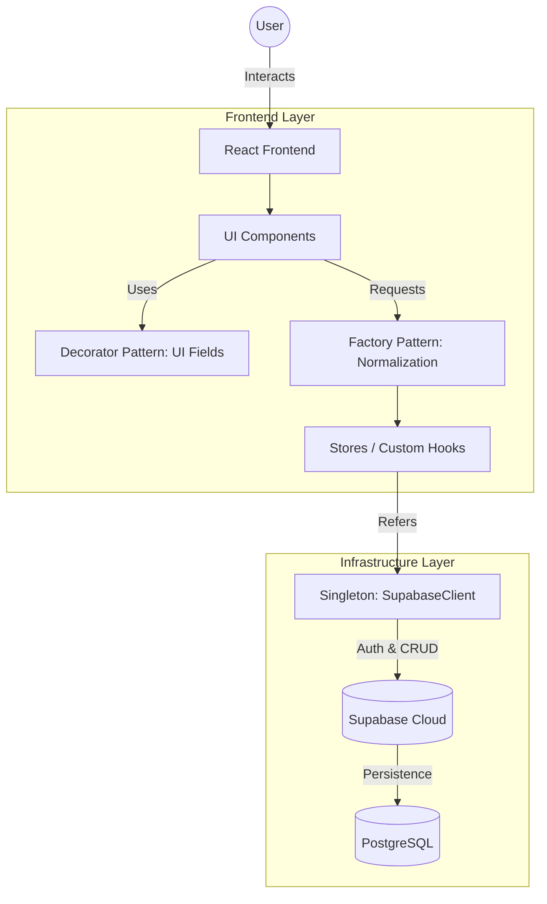
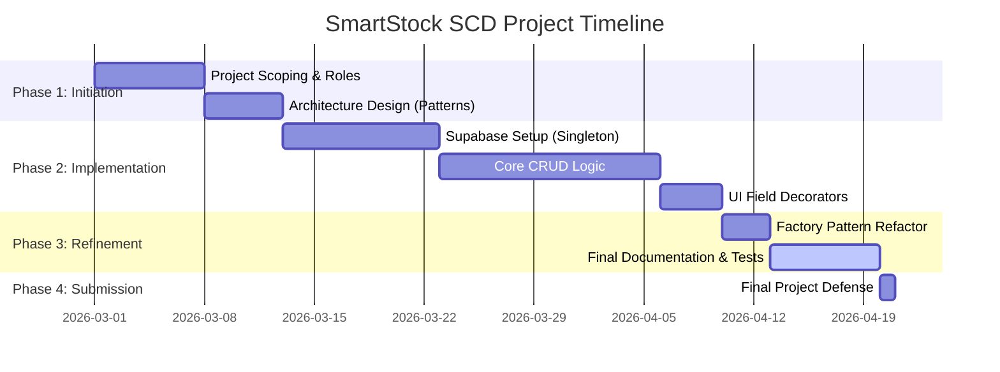

# FINAL PROJECT DOCUMENTATION: SmartStock

**Course:** Software Component Design (SCD) | **Section:** BSSE 2  
**Term:** 2nd Semester, A.Y. 2025–2026  
**Date of Submission:** April 15, 2026

---

## 1. Title Page

**Project Title:** SmartStock – Intelligent Inventory & Supply Management System  
**System Name:** SmartStock  
**Repository URL:** [https://github.com/auauron/SmartStock](https://github.com/auauron/SmartStock)

**Group Members:**

- **Iniego Bargas** (Project Manager)
- **Ahron John Alera** (Fullstack Developer)
- **Ashley Nicole Gellado** (Fullstack Developer)

---

## 2. Member Roles

| Member Name               | Role                | Responsibilities                                                                                                                                 |
| :------------------------ | :------------------ | :----------------------------------------------------------------------------------------------------------------------------------------------- |
| **Iniego Bargas**         | Project Manager     | Overseeing project lifecycle, coordinating team meetings, documenting system architecture, and managing the project timeline (Gantt chart).      |
| **Ahron John Alera**      | Fullstack Developer | Backend infrastructure, Supabase client configuration (Singleton Pattern), secure authentication implementation, and database schema management. |
| **Ashley Nicole Gellado** | Fullstack Developer | Frontend component development, UI/UX consistency, form field composition (Decorator Pattern), and inventory CRUD logic.                         |

---

## 3. Problem Statement

### 3.1 Background and Importance

Inventory management is the backbone of any retail or logistics operation. Small-to-medium enterprises (SMEs) often rely on fragmented systems—ranging from manual ledger entries to unlinked spreadsheets—which are prone to human error. Inaccurate stock counts lead to two critical business failures: **stockouts** (missed sales opportunities) and **overstocking** (tied-up capital and storage waste).

### 3.2 Current Challenges

The current landscape of inventory solutions presents a "complexity gap." Enterprise-level ERP systems are cost-prohibitive and difficult to configure for small teams, while basic spreadsheets lack real-time synchronization and multi-user audit trails. Furthermore, manual entry systems fail to provide proactive notifications for low-stock scenarios, leading to reactive rather than proactive supply chain management.

### 3.3 Target Stakeholders

The target users for SmartStock are warehouse managers and inventory clerks who require a fast, mobile-responsive tool to track stock levels on the warehouse floor. By streamlining the "Restock to Inventory" workflow, SmartStock aims to serve as the definitive single source of truth for stock availability.

---

## 4. Application Overview

SmartStock is a feature-rich Web Application designed to bridge the gap between simple tracking and complex ERPs. Built using a modern tech stack (React, TypeScript, and Supabase), it provides:

- **Real-time Synchronization:** Instant updates across all user sessions.
- **Intelligent Tracking:** Automated status labelling (In Stock, Low Stock, Out of Stock).
- **Proactive Management:** A dedicated "Restock" flow that links supply entries directly to inventory totals.
- **Cross-Platform Access:** Responsive design allows for usage on both desktop and mobile devices.

---

## 5. Proposed Solution

The proposed solution implements a **Pattern-Driven Architecture** to ensure long-term maintainability. By separating concerns between data acquisition (Supabase), object instantiation (Factory Method), and UI presentation (Decorator Pattern), the system achieves strict decoupling. The workflow involves a high-speed data entry layer where clerks can scan or manually enter restock data, which is then processed through a normalization layer before updating the global cloud state.

---

## 6. Goals and Objectives

1. **Architectural Integrity:** Implement at least three design patterns (Singleton, Decorator, and Factory Method) where each pattern solves a distinct architectural bottleneck.
2. **Operational Efficiency:** Enable inventory updates to be completed in under 10 seconds per item through an optimized UI/UX design.
3. **Data Consistency:** Maintain 100% synchronization between local device state and the cloud database using synchronous client instance management.
4. **User Adoption:** Design an interface that requires zero training for inventory personnel familiar with basic spreadsheet concepts.

---

## 7. Design Patterns Used

### 7.1 Singleton Pattern (Creational)

- **Pattern Name:** Singleton Pattern
- **Category:** Creational
- **Location in Code:** `src/lib/supabaseClient.ts`
- **Problem Without the Pattern:** Without the Singleton pattern, every component that requires database access would need to instantiate its own Supabase client. This leads to duplicate connection handshakes, inconsistent authentication listeners, and a significant increase in memory usage as the number of active components grows.
- **Proposed Solution:** Centralize the client initialization in a single module that exports a pre-configured instance.
- **How the Pattern Solves It:** By ensuring only one instance of the `SupabaseClient` exists, we guarantee that all authentication states and real-time subscriptions are unified. This prevents scenarios where one part of the app is "logged out" while another still sees protected data.
- **Design Principle Upheld:** **Single Responsibility Principle (SRP)**. The management of the backend connection is delegated to one specialized module.

### 7.2 Decorator / Composition Pattern (Structural)

- **Pattern Name:** Decorator Pattern (React Component Composition)
- **Category:** Structural
- **Location in Code:** `src/components/ui/InputField.tsx`, `src/components/ui/DropdownField.tsx`
- **Problem Without the Pattern:** Managing form fields with labels, icons, and validation messages would require building complex, single-file components for every field type. Removing the decorator logic would return us to "Prop Drilling" where layout logic is duplicated across every page, making a simple change (like adding an icon) a massive refactoring task.
- **Proposed Solution:** "Decorate" standard HTML input/select elements with reusable Layout Wrappers that handle label positioning, Lucide-icons, and styling.
- **How the Pattern Solves It:** The `InputField` and `DropdownField` act as wrappers that preserve the original element's interface while adding presentational "decorations." This allows the business logic (the input value) to remain separate from the aesthetic logic (the wrapper).
- **Design Principle Upheld:** **Open/Closed Principle (OCP)**. We can add new decorative features (like tooltips or character counters) to all fields by modifying only the decorator wrapper, without touching the native input logic.

### 7.3 Factory Method Pattern (Creational)

- **Pattern Name:** Factory Method Pattern
- **Category:** Creational
- **Location in Code:** `src/factories/inventoryFactory.ts`
- **Problem Without the Pattern:** Creating new inventory or restock entries currently occurs in fragmented locations (modals and pages). This leads to inconsistent data structures, where some items might miss essential fields or fail validation checks, causing runtime errors in the dashboard.
- **Proposed Solution:** Move all object creation into a specialized Factory class that handles default value assignment and normalization.
- **How the Pattern Solves It:** The Factory acts as a gateway; the UI components simply request a "New Inventory" object, and the Factory returns a perfectly structured entity. This decouples the "How to build an inventory item" logic from the "Where to display an inventory item" logic.
- **Design Principle Upheld:** **Dependency Inversion Principle (DIP)**. High-level UI components no longer depend on low-level constructor logic; they depend on the Factory abstraction.

---

## 8. System Architecture Diagram

---

## 9. Features

- **Real-time Inventory Dashboard:** Searchable, filterable list of all warehouse inventory.
- **Stock Level Indicators:** Color-coded status badges driven by business logic (Out of Stock < Low Stock).
- **Restock History Management:** Audit trail of when and how many items were added to inventory.
- **Auth-Protected Access:** Row-Level Security (RLS) ensures members only see their group's data.
- **Responsive Design:** Fast performance on both warehouse tablets and desktop workstations.

---

## 10. Project Timeline (Gantt Chart)

---

## 11. References

- Gamma, E., et al. (1994). _Design Patterns: Elements of Reusable Object-Oriented Software_. Addison-Wesley.
- Vercel (2025). _React Design Patterns: Composition vs Decoration_.
- Supabase (2026). _Managing Client Instances in Single Page Applications_.

---

### _CONVERSION TO GOOGLE DOCS:_

_To move this into Google Docs seamlessly:_

1. _Open Google Drive and select **New > File Upload**._
2. _Upload this Markdown file (`SMARTSTOCK_FINAL_PROJECT.md`)._
3. _Right-click the file in Drive and select **Open with > Google Docs**._
4. _Google Docs will automatically convert the headers, tables, and lists into its native format._
5. _For the Mermaid diagrams, you can take a screenshot of the rendered versions and paste them into your Doc._
